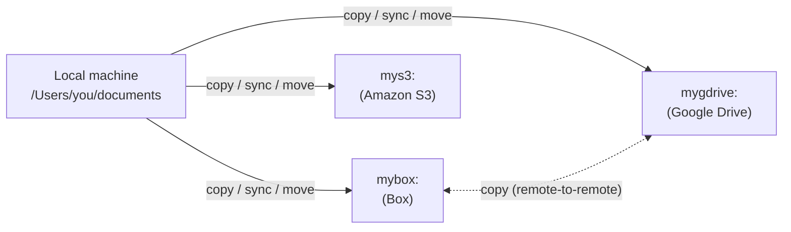

:::::: questions
 - What are Rclone remotes?
 - How are they used?
 - How do remotes facilitate file transfers and synchronization in rclone?
::::::

:::::: objectives
- Understand what a remote is and how it differs from a local connection.
- Distinguish a local filesystem path from a remote path in the form `remote:path`.
- Identify common cloud storage services (e.g., Box, Google Drive, Amazon S3) and understand their roles as remotes.
::::::

## Creating a remote connection

A remote is a named storage configuration that rclone uses to connect to a storage location, such as a cloud service or another machine. You create a remote once using `rclone config`, then refer to it by name in commands as `remote:path` (for example, `mybox:documents`). This is different from a local filesystem path, such as `/Users/name/documents` or `C:\Users\name\Documents`, which refers to storage on your own machine and has no `remote:` prefix.

Common remote types include cloud storage services such as Box, Google Drive, and Amazon S3, as well as other servers accessed over protocols such as SFTP.

::::::::::::::::: callout

### Custom client IDs: Google Drive vs. Box

By default, rclone uses a shared `client_id` for both Google Drive and Box, so most learners do not need to set up their own credentials to complete this lesson.

For **Google Drive**, rclone's shared client ID is being retired and will stop working during 2026. Create and configure your own `client_id` and `client_secret` to avoid an interruption. See [Making your own client ID](https://rclone.org/drive/#making-your-own-client-id) in the rclone documentation for details.

For **Box**, the [Box documentation](https://rclone.org/box/) notes that custom client credentials can normally be left blank. Most users do not need to set up their own `client_id` for Box; only do so if you hit rate limits or your organization requires it.

:::::::::::::::::::::::::

:::::: keypoints
- A remote is any storage location that is not part of your local machine but can be accessed via rclone.
- Remotes enable file transfers and synchronization between various systems, including cloud services (e.g., Google Drive, Amazon S3, Box) and local machines.
- The rclone config command is used to create, manage, and secure remote connections.
- Google Drive's shared client ID is being retired in 2026 and needs your own credentials; Box's client ID can normally stay blank.
::::::
