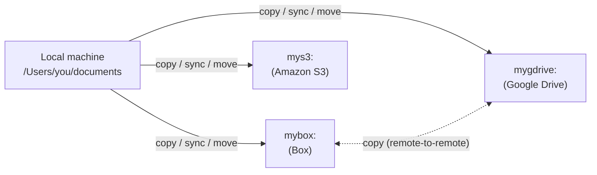

:::::: questions
 - What is an rclone remote, and how is it different from a local path?
 - How do you create, list, and verify a remote connection?
::::::

:::::: objectives
 - Understand what a remote is and how it differs from a local connection.
 - Distinguish a local filesystem path from a remote path in the form `remote:path`.
 - Use `rclone config` to create a remote connection.
 - Use `rclone listremotes` and `rclone lsd remote:` to confirm a remote is configured and reachable.
::::::

## Creating a remote connection

A remote is a named storage configuration that rclone uses to connect to a storage location, such as a cloud service or another machine. You create a remote once using `rclone config`, then refer to it by name in commands as `remote:path` (for example, `mybox:documents`). This is different from a local filesystem path, such as `/Users/name/documents` or `C:\Users\name\Documents`, which refers to storage on your own machine and has no `remote:` prefix.

Common remote types include cloud storage services such as Box, Google Drive, and Amazon S3, as well as other servers accessed over protocols such as SFTP.



::::::::::::::::: callout

### Custom client IDs: Google Drive vs. Box

By default, rclone uses a shared `client_id` for both Google Drive and Box, so most learners do not need to set up their own credentials to complete this lesson.

For **Google Drive**, rclone's shared client ID is being retired and will stop working during 2026. Create and configure your own `client_id` and `client_secret` to avoid an interruption. See [Making your own client ID](https://rclone.org/drive/#making-your-own-client-id) in the rclone documentation for details.

For **Box**, the [Box documentation][rclone-box] notes that custom client credentials can normally be left blank. Most users do not need to set up their own `client_id` for Box; only do so if you hit rate limits or your organization requires it.

:::::::::::::::::::::::::

## Configuring a remote with `rclone config`

The `rclone config` command starts an interactive session where you create, edit, and manage remotes.

```bash
rclone config
```

The first time you run it, with no remotes configured yet, you'll see:

```output
No remotes found, make a new one?
n) New remote
s) Set configuration password
q) Quit config
n/s/q>
```

Choose `n` for a new remote. Rclone asks for a name, then the storage type from a long list of supported providers:

```output
Enter name for new remote.

Option Storage.
Type of storage to configure.
Choose a number from below, or type in your own value.
 1 / 1Fichier
   \ (fichier)
 2 / Akamai NetStorage
   \ (netstorage)
...
 7 / Box
   \ (box)
...
36 / Local Disk
   \ (local)
...
```

Type `mybox` for the name and `box` for the type. Accept the defaults for `client_id` and `client_secret` unless the callout above tells you otherwise. For a remote that needs authorization, like Box or Google Drive, rclone will next either open a browser window for you to sign in, or, on a machine without a browser available, print a URL and code to enter on another device — see [Configuring using rclone authorize][rclone-authorize] in the rclone documentation for that case.

Once you've stepped through the provider-specific prompts, rclone shows a summary and asks you to confirm:

```output
Configuration complete.
Options:
- type: box
Keep this "mybox" remote?
y) Yes this is OK (default)
e) Edit this remote
d) Delete this remote
```

Answer `y`, then `q` to quit the config session. Your new remote is saved.

## Checking your configuration

Once a remote exists, use these commands to confirm it's there and working. None of them transfer or change any files, so they're safe to run at any time.

List every remote rclone knows about:

```bash
rclone listremotes
```

```output
mybox:
```

Find out where the configuration file itself lives — worth knowing, since it's the file that holds your credentials (see the callout above):

```bash
rclone config file
```

```output
Configuration file is stored at:
/Users/you/.config/rclone/rclone.conf
```

List the contents of the remote itself:

```bash
rclone lsd mybox:
```

```output
          64 2026-08-23 13:27:28        -1 rclone-workshop
```

`lsd` lists directories only and never transfers a file, which makes it a safe way to confirm a remote is reachable before you run a real transfer command.

## Rclone command flags

There are numerous command flags but these three are especially worth remembering:

- **-n, --dry-run**         Do a trial run with no permanent changes
- **-i, --interactive**     Enable interactive mode
- **-v, --verbose count**   Print lots more stuff (repeat for more) - useful when debugging

::::::::::::::::::::::::::::::::::::: challenge

## Configure and verify your own remote

Using `rclone config`, create a remote connected to your own Box account (or whichever storage your instructor has set up for this workshop). Then:

1. Confirm it appears in `rclone listremotes`.
2. Run `rclone lsd remote:` to see its contents.

:::::::::::::::: hint

If `rclone lsd` returns an error, run `rclone listremotes` first — a typo in the remote name is the most common cause.

::::::::::::::::::::::

:::::::::::::::: solution

```bash
rclone config
```

Follow the prompts: `n` for a new remote, a name such as `mybox`, `box` for the type, defaults for the client ID and secret, and complete the authorization step. Confirm with `y`, then `q` to quit.

```bash
rclone listremotes
```

```output
mybox:
```

```bash
rclone lsd mybox:
```

If your Box account has no folders yet, this returns nothing — that's expected, and still confirms the remote is reachable.

::::::::::::::::::::::

:::::::::::::::::::::::::::::::::::::::::::::::

## Documentation specific to each remote

Rclone includes extensive documentation that is specific to particular remotes.

Examples:

- Box: [rclone.org/box/][rclone-box]
- Google Drive: [https://rclone.org/drive/](https://rclone.org/drive/)
- S3 bucket: [https://rclone.org/s3/](https://rclone.org/s3/)

See the [Learner Reference](../learners/reference.md) page for a full command and documentation reference.

:::::: keypoints
 - A remote is a named storage configuration; a local path has no `remote:` prefix.
 - Use `rclone config` to create, edit, and manage remotes.
 - Use `rclone listremotes`, `rclone config file`, and `rclone lsd remote:` to confirm a remote is set up and reachable, without transferring anything.
 - Google Drive's shared client ID is being retired in 2026 and needs your own credentials; Box's client ID can normally stay blank.
::::::
