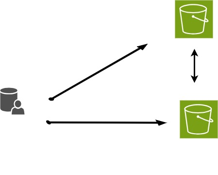

:::::: questions  
 -  What is rclone?  
-   Why might you use this application?  
-   How could rclone help you manage your data?   
::::::  

:::::: objectives
-   Basic knowledge of rclone usage
-   Be able to transfer data from the command line using rclone
-   Know where to get help and examples
    ::::::

## Introduction

Rclone is a *command line* program to manage files on cloud storage. After download and install, continue here to learn how to use it: Initial configuration, what the basic syntax looks like, describes the various subcommands, the various options, and more.



## Challenge 1: What can you do with Rclone?

How might you use Rclone?

::::::::::::::::::::::::::::::::::::: solution

Move files both local and online

## Discussion: How do you think you might use rclone?  
```    
```
- For large files and/or multiple files rclone is efficient and fast
- Backup work   
:::

## Rclone command syntax

##### rclone [command] source:source-folder  destination:destination-folder 


List of rclone commands: [https://rclone.org/commands/](https://rclone.org/commands/) 


:::::: keypoints
 - Uses for rclone
 - where to find and download 
::::::
