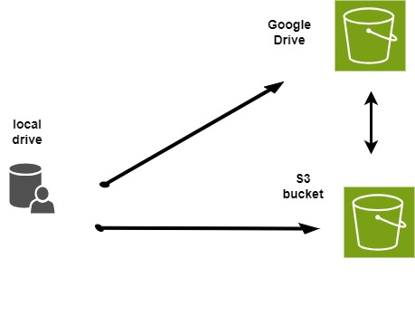

:::::: questions
 - What are rclone remotes?
 - What/how are they used?
::::::

:::::: objectives
 - Understand the concept of a remote or local connection
 - 
::::::

## Creating a remote connection

An rclone remote is a storage service or device that's not part of the local machine, but can be accessed using the rclone command line tool. Rclone remotes can be used to transfer and synchronize files between cloud storage services, servers, and machines. 

## Reference
[https://rclone.org/commands/rclone_config/](https://rclone.org/commands/rclone_config/)

:::::: keypoints
 - Remote and local rclone connections
 - keypoint 2
::::::
