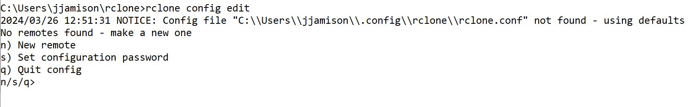

:::::: questions
 - Once installed, how is Rclone setup or configured?
 - How to check for and edit existing configurations
 - what is a remote/headless machine 
 
::::::

:::::: objectives
 - Use config to create remote connections
 - Knowledge of useful command flags (or 'options') 
 - Configure a remote connection for a machine with no browser available (ie. headless) 
 
::::::

## Rclone config command: 

The *rclone config" command enteres an interactive configuration session where you can setup new remotes, edit and manage existing ones. 

## syntax:  
**Rclone config [flags]**
 
  
sand

## Rclone command flags

There are numerous command flags but these three are especially worth remembering:

- **-n, --dry-run**         Do a trial run with no permanent changes
- **-i, --interactive**     Enable interactive mode
- **-v, --verbose count**   Print lots more stuff (repeat for more) - useful when debugging  

[live-code a setting up a simple remote]

**Walk through configuring a local machine**

**Walk through configuring a remote that requires authorization**

## Configuring rclone on a remote/headless machine  

A *headless* machine is one that has no browser available.  For example you are using Windows WSL2 Linux subsystem or you logged into a remote machine (HPC, AWS, etc.) using your termnial client. 

Some of the configurations (those involving oauth2) require an Internet connected web browser.

We are going to walk through this but here is an example from the Rclone documentation [https://rclone.org/remote_setup/#configuring-using-rclone-authorize](https://rclone.org/remote_setup/#configuring-using-rclone-authorizef).

  

## Documentation Specific to Remote    

Rclone includes extensive documentation that is specific to particular remotes.

Examples:   

- box: [https://rclone.org/box/](https://rclone.org/box/)  
- google drive: [https://rclone.org/drive/](https://rclone.org/drive/)  
- S3 bucket: [https://rclone.org/s3/](https://rclone.org/s3/)  

## Reference   

[https://rclone.org/remote_setup/](https://rclone.org/remote_setup/)  

[https://rclone.org/commands/rclone_config/](https://rclone.org/commands/rclone_config/)

[https://rclone.org/flags/#important](https://rclone.org/flags/#important)

:::::: keypoints
 - Understand how configuration is used.  
 - Familiar with useful command flags: dry-run, interactive and verbose.
 - Use config to create remote connections
 - Know where to get help.
::::::
