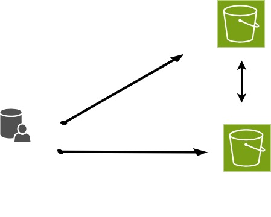

:::::: questions  
 -  What is Rclone?  
-   Why might you use this application?  
-   How might Rclone help you manage your data?   
::::::  

:::::: objectives  
-   Basic understanding of Rclone usage 
-   Know where to download the software and documentation
-   Know where to get help and examples 
::::::

## Introduction: What is Rclone?

Rclone is a command-line program for managing files on cloud storage. It is primarily used for transferring, syncing, and moving data between local systems and various cloud storage services.

:::::::::::::::::::::::::::::::::::: challenge

## What can you do with Rclone?

Which statement best describes what Rclone does?

A. Rclone runs continuously in the background, syncing your computer with the cloud in real time, like a Dropbox or OneDrive desktop client.  
B. Running `rclone copy` once is a complete backup strategy: it keeps the destination in sync with every future change to the source.  
C. Rclone transfers, syncs, or moves files between local and cloud storage, or between two cloud storage services, each time you run a command.  
D. Rclone requires mounting cloud storage as a local drive before it can move any files.

::::::::::::::::::::::::::::::::::::: solution

The answer is C.

Rclone is command-driven.
It acts when you run `rclone copy`, `sync`, or `move`, not automatically in the background.

- A is incorrect. Unlike a desktop sync client, rclone does not watch for changes and act on its own.
  You have to run a command (or schedule one) each time you want it to check for changes.
- B is incorrect. `copy` never deletes files at the destination, so the destination can accumulate files that no longer exist at the source.
  A single `copy` does not guarantee the two locations match: `sync`, covered later in this lesson, is designed for that.
- D is incorrect. Mounting is an optional, more advanced feature.
  Copy, sync, and move all work directly on cloud storage without mounting anything.

::::::::::::::::::::::::::

:::::::::::::::::::::::::::::::::::::::::::

::::::::::::::::: discussion
## How do you think you might use Rclone?  

Think of a file-transfer task you currently do by hand: dragging files between a laptop and an external drive, uploading through a browser, or copying the same files to more than one place.

- Would copy, sync, or move fit that task best, and why?
- Are you moving files between two machines, two cloud services, or a machine and a cloud service?
- Is there a point in your current process where you're not sure whether a transfer actually finished, or whether you'd notice if it didn't?

Share one example in the chat or with a neighbor.

::::::::::::::::::::::::::::::

## Rclone command syntax

### `rclone [command] source:source-folder  destination:destination-folder`

List of Rclone commands: [https://rclone.org/commands/](https://rclone.org/commands/) 

## Real-World Scenarios for Using Rclone

Understanding how Rclone works can be easier if you relate it to everyday tasks. Here are a few simple examples:

- **Copy:**  
  Imagine you have a folder of vacation photos on your laptop and want to back them up to Google Drive without removing them from your computer. Using `rclone copy` will duplicate your pictures to the cloud, leaving the originals intact.

- **Sync:**  
  Suppose you're working on a project at home and in the office. You keep a copy of your project folder on your computer and a backup in the cloud. Each time you run `rclone sync`, it copies any local changes to the cloud folder and removes any cloud files that are no longer present locally, keeping the two folders identical.

- **Move:**  
  After completing a project, you can free up space on your computer by archiving files to the cloud. The `rclone move` command transfers your project files to cloud storage and deletes them from your local drive.

These examples show how each rclone command can help you manage your files based on your needs.

:::::: keypoints
 - Uses for Rclone
 - Where to find versions for specific operating systems
 - Where to get help
::::::
