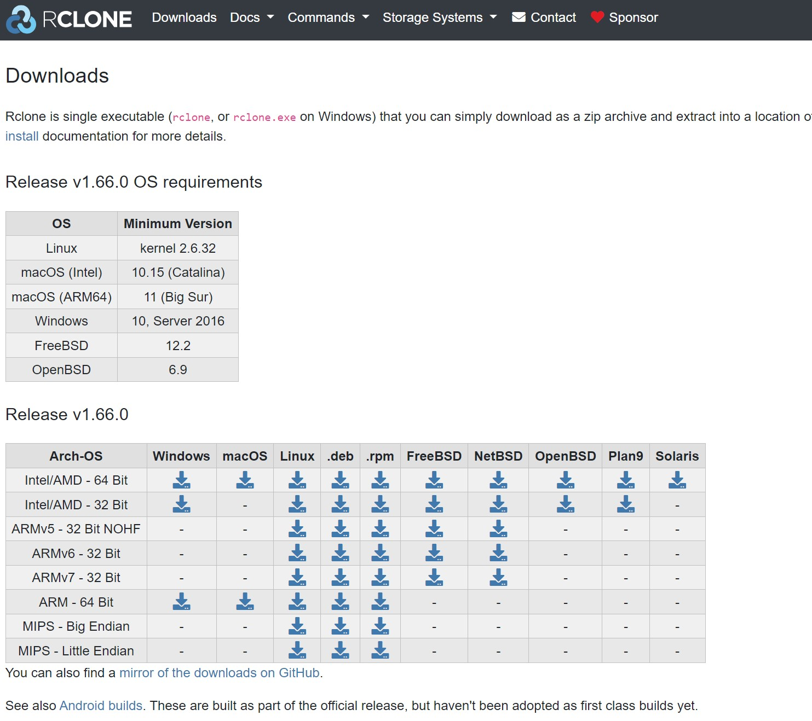

## Software Setup

Rclone is a cross-platform application that runs on Linux, Windows, and macOS. Below you'll find tailored installation instructions for your operating system. For more details or alternative methods, visit the [Rclone download page](https://rclone.org/downloads/).

   

## Rclone downloads for various OS 

::::::::::::::::: tab
    
### Windows
    
1. Visit the [Windows installation page](https://rclone.org/install/#windows).
2. Download the appropriate zip file for your system.
3. Extract the downloaded zip file to a folder of your choice.
4. (Optional) Add the folder to your system's PATH environment variable for easy command-line access.
5. Open Command Prompt or PowerShell and run:

```bash
rclone version
```  

to verify the installation.

:::::::::::::::::::::::::

::::::::::::::::: tab

### macOS

1. Go to the [macOS installation page](https://rclone.org/install/#macos).
2. You can install rclone using Homebrew by running:

```bash
brew install rclone
```

or download the precompiled binary from the website.
3. Verify your installation by opening Terminal and executing: 

```bash
rclone version
```

:::::::::::::::::::::::::

::::::::::::::::: tab

### Linux

1. Visit the [Linux installation page](https://rclone.org/install/#linux) for detailed instructions.
2. The easiest installation method is using the provided script. Open your terminal and run:

```bash
curl https://rclone.org/install.sh | sudo bash
```

This downloads and installs the latest version of rclone.
3. Confirm the installation by typing: 

```bash
rclone version
```
:::::::::::::::::::::::::
