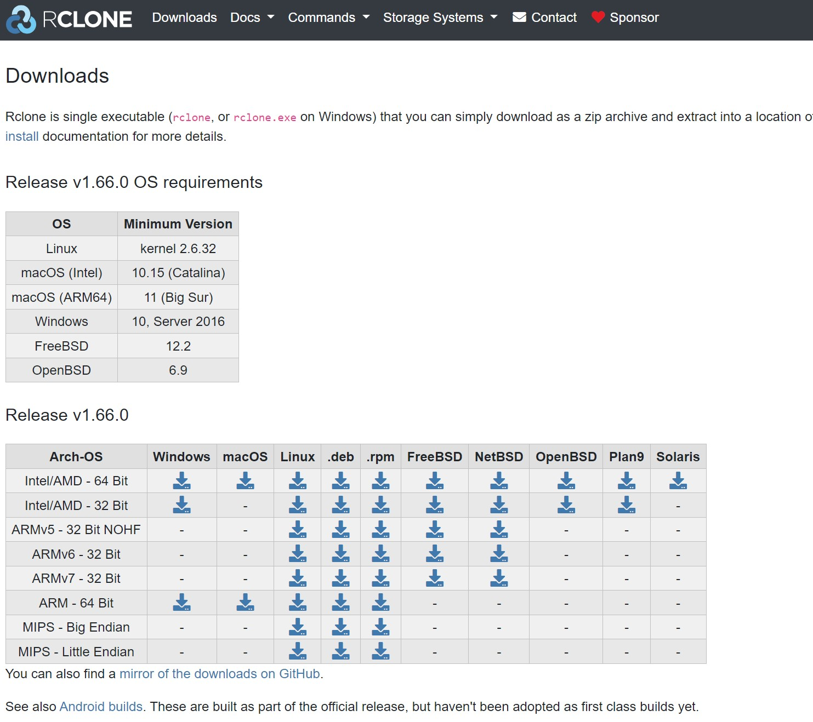

## Software Setup

Rclone is a cross-platform application. It runs on Linux, Windows and
MacOS. 

The installation files for different systems can be found on the
Rclone download page. 

[rclone downloads for various OS](https://rclone.org/downloads/) 

   

## Rclone downloads for various OS 

### Windows

[Windows installation](https://rclone.org/install/#windows)

### MacOS

[macOS installation](<https://rclone.org/install/#macos>)

### Linux

[Linux installation](https://rclone.org/install/#linux)
